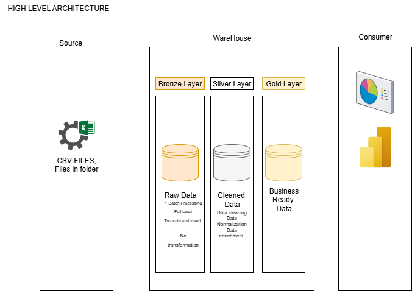

# 💾 Blinkit Retail SuperMarket Analytics (SQL + Power BI)


---

### 📘 Overview  
End-to-end **Data Warehousing and Analytics** for Blinkit sales.  
Implements the **Medallion** pattern (Bronze → Silver → Gold), DQ rules, SQL automation, and a Power BI report that uses **measures defined on Silver** (Gold is used to validate alignment).

---

### ⚙️ Key Features  
- 🗂️ **Data Source:** Blinkit grocery dataset (file import).  
- 🧹 **Data Quality:** Trim text, normalize fat content, set `Item_Visibility=0 → NULL`, impute `Item_Weight` by `Item_Type` average.  
- 🔗 **Modeling:** Silver = row-grain clean facts; Gold = aggregated KPIs (also available as a view).  
- 🤖 **Automation:** Stored procedures for Silver load; Gold exposed as a **view** (or table if you prefer).  
- 📑 **Documentation:** Professional **Data Dictionary & QA** and complete **SQL tests**.

---

### 🧩 Data Architecture  
Follows the **Medallion Pattern**:




**Layers**  
1. **Bronze:** Raw import (from Excel/CSV).  
2. **Silver:** Cleaned, standardized rows used directly in Power BI measures.  
3. **Gold:** Aggregates for validation/exports. Provided as a view for live rollups.

---

### 🔄 ETL / Load Flow  
- Bronze → Silver: cleaning + standardization via stored proc  
- Silver → Gold: on-demand view (or proc + table, if you want materialization)  
- Power BI: connects to **Silver** for measures; **Gold** used to confirm counts and totals

---


### 📦 Deliverables
| 📁 Deliverable | 🧾 Location |
|---|---|
| **Architecture image** | [`docs/blinkit_architecture.png`](docs/blinkit_architecture.png) |
| **Power BI view screenshot** | [`docs/blinkit_powerbi_view.png`](docs/blinkit_powerbi_view.png) |
| **SQL QA tests (Silver ↔ Gold)** | [`test/blinkit_sql_qa_tests.sql`](test/blinkit_sql_qa_tests.sql) |
| **Data Dictionary & QA (Word)** | [`docs/Blinkit_Data_Dictionary_and_QA.docx`](docs/Blinkit_Data_Dictionary_and_QA.docx) |


---

### 📁 Project Structure (suggested)

/sql
/ddl
/dml
/tests
/docs
/assets
/powerbi


---

### 🚀 Quick Start  

1) **Create/refresh Silver**  
- Use the Silver DDL to create `silver.blink_supermarket_info_clean`  
- Run the load proc (cleans trims, normalizes fat, fixes visibility, imputes weight)

2) **Expose Gold as a view (recommended)**  
```sql
IF OBJECT_ID('gold.v_blink_sales_summary','V') IS NOT NULL
  DROP VIEW gold.v_blink_sales_summary;
GO
CREATE VIEW gold.v_blink_sales_summary AS
SELECT
  Item_Fat_Content, Item_Type, Outlet_Identifier,
  Outlet_Location_Type, Outlet_Size, Outlet_Type, Outlet_Establishment_Year,
  COUNT(DISTINCT Item_Identifier) AS Number_of_Items,
  SUM(Sales) AS Total_Sales,
  AVG(Sales) AS Average_Sales,
  AVG(Rating) AS Average_Rating
FROM silver.blink_supermarket_info_clean
GROUP BY
  Item_Fat_Content, Item_Type, Outlet_Identifier,
  Outlet_Location_Type, Outlet_Size, Outlet_Type, Outlet_Establishment_Year;
GO


Run QA

Execute:Execute: test/blinkit_sql_qa_tests.sql

Validate Silver ↔ Gold equality on groups and KPIs.


Power BI

Connect to SQL (Silver table + Gold view).

Create measures on Silver (example):

Total Sales     = SUM('silver.blink_supermarket_info_clean'[Sales])
Average Sales   = AVERAGE('silver.blink_supermarket_info_clean'[Sales])
Number of Items = DISTINCTCOUNT('silver.blink_supermarket_info_clean'[Item_Identifier])
Average Rating  = AVERAGE('silver.blink_supermarket_info_clean'[Rating])


(Optional) Metric selector via field parameters or a disconnected table.

📊 Analytics & Reporting Goals

🛒 Product performance by Item_Type and fat content

🏬 Outlet performance by type, size, and location tier

💰 Sales distribution and averages

⭐ Rating trends

🔍 Validations (What we test)

Row Grain: Silver row count vs Gold group count

KPI Recalc: Rebuild KPIs from Silver and match Gold per group

Coverage: No missing/extra Gold groups vs Silver distinct keys

Global Totals: Sales and rating reconciliations

See: blinkit_sql_qa_tests.sql and powerbi_qa_measures.dax

🧰 Stack

🧩 SQL Server

📈 Power BI

📊 Excel / CSV (Source)

📜 License

MIT — free to use, modify, and share.

👤 Author

Samuel Amoo
Business Analyst & Software Engineer
📧 samuelamoo@gmail.com

🔗 LinkedIn: https://www.linkedin.com/in/samuel-amoo/
